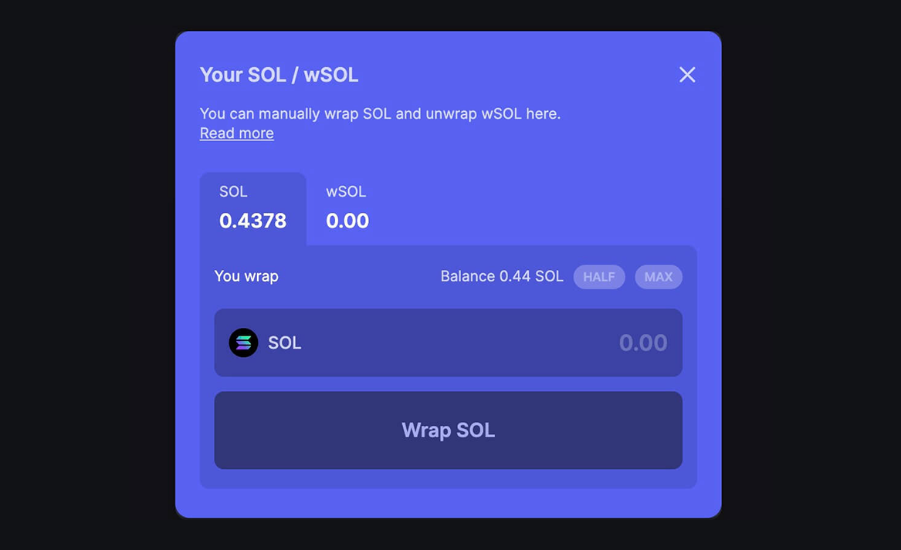
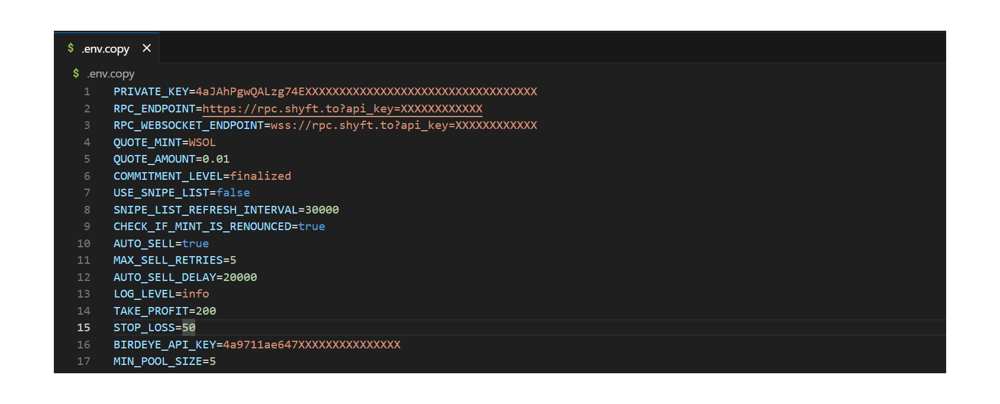
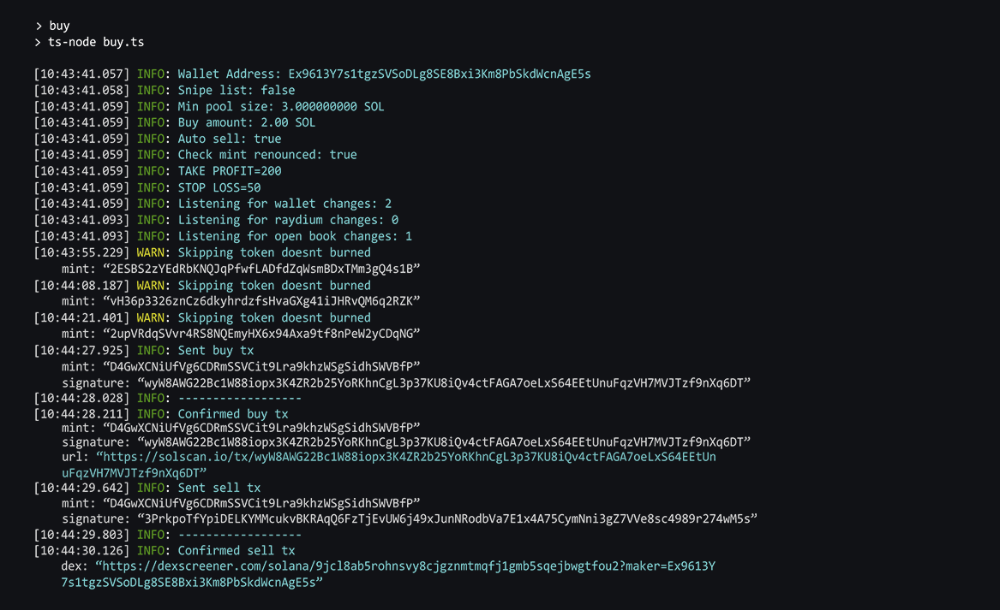
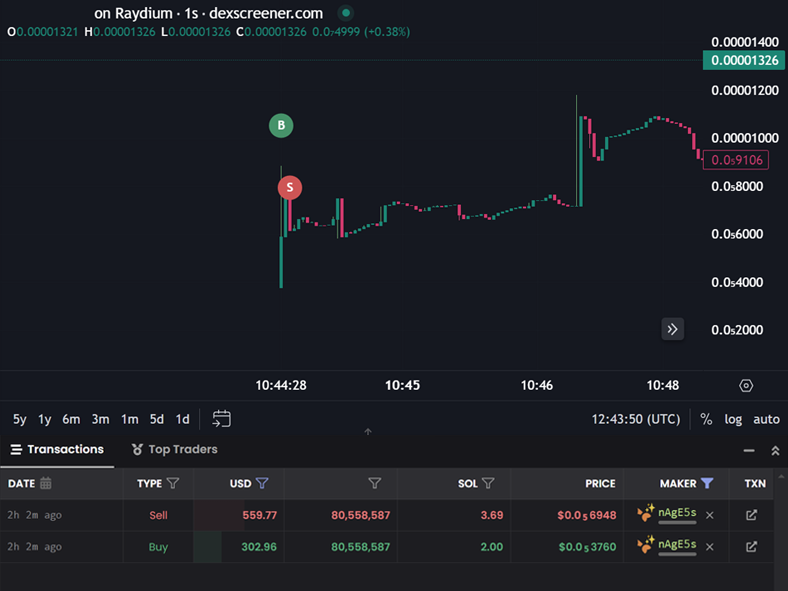
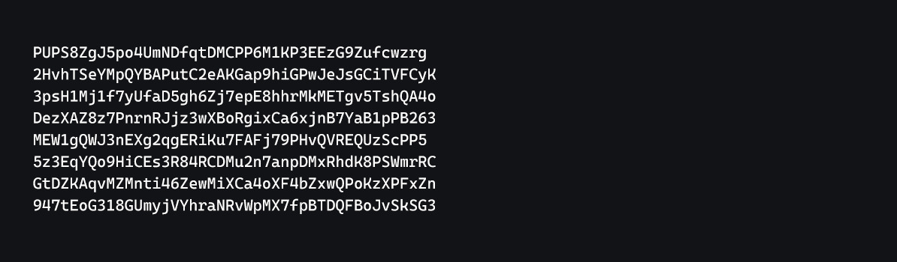

# 🌟 The Ultimate 2025 Solana Raydium Sniper Bot 🚀

### **High-Speed Token Trading | Free Crypto Trading Bot for USDC/SOL Pools | Profit-Powered Automation**  
*(Updated December 2024)*

Introducing **SIORA**, the cutting-edge 2025 Solana Raydium Sniper Bot. Whether you're a Solana enthusiast or a memecoin trader, this bot is your go-to tool for automated crypto profits. With SIORA, you can snipe new Raydium USDC/SOL pools before they appear on the Raydium UI, leveraging ultra-optimized RPC nodes for maximum speed and efficiency.

---

### **🚀 Why Choose SIORA?**

- **Unmatched Speed:** Execute token purchases faster than ever.
- **Automation Simplified:** Runs seamlessly, even for new traders.
- **Feature-Rich:** 
  - `WSOL Snipe`
  - `Auto-Sell`
  - `Take Profit/Stop Loss (TP/SL)`
  - `Liquidity Checks`
  - `Renounce Checks`
  - `Fast Buy`

> **Disclaimer:** Provided as-is, for educational purposes. Use responsibly.  

---

## **⚙️ SETUP**

1. **Prepare Your Wallet**: Use a Solana wallet loaded with some SOL.
2. **Get USDC or WSOL**: Convert SOL to USDC or WSOL (we recommend WSOL for speed).
   - Use [Jupiter Wrap](https://jup.ag/) to convert SOL to WSOL.  
     
3. **Allocate Funds**: Keep a 1:10 ratio (e.g., 1 WSOL per 10 SOL). Always have extra SOL for transaction fees.
4. **Risk Management**: SIORA boasts a 95%+ win rate, but only trade what you're prepared to lose.

---

## **🛠️ CONFIGURATION**

1. **Edit the `.env.example` File**: Rename it to `.env` and update:
   - `PRIVATE_KEY` (your wallet's private key).
   - `RPC_ENDPOINT` & `RPC_WEBSOCKET_ENDPOINT` (use Helius/Quicknode for fast nodes).
   - `QUOTE_MINT` (choose USDC or WSOL pools).
   - `QUOTE_AMOUNT` (amount per trade).
   - Various parameters like `TAKE_PROFIT`, `STOP_LOSS`, `MIN_POOL_SIZE`, etc.
   
   

2. **Key Features**:
   - `CHECK_IF_IS_BURNED`: Check if liquidity is burned.
   - `CHECK_IF_IS_LOCKED`: Verify locked liquidity.
   - `CHECK_IF_MINT_IS_RENOUNCED`: Only trade if mint is renounced.
   - `SNIPE_LIST`: Define specific tokens to snipe.

---

## **📥 INSTALLATION**

1. Navigate to the bot directory: `cd <bot file location>`
2. Install dependencies: `npm install`
3. Start the bot: `npm run start`

---

## **📈 TAKE PROFIT & STOP LOSS**

- **Take Profit (Default: 50%)**: Automatically sell when profit reaches 50%.
- **Stop Loss (Default: 30%)**: Automatically sell if loss exceeds 30%.

> Adjust these parameters in the configuration file as needed.

---

## **⚡ AUTO SELL**

- **Enabled by Default**: Automatically sells tokens after purchase.
- **Customization Options**:
  1. Set `AUTO_SELL` to `false` to disable.
  2. Adjust `MAX_SELL_RETRIES` for retries.
  3. Set `AUTO_SELL_DELAY` (in milliseconds) for delayed sells.

> Tokens are sold based on configuration. No guarantee of profit or sale. Use with caution.

---

## **🎯 SNIPE LIST**

- **Purpose**: Focus on specific tokens during launch events.
- **How to Use**:
  1. Set `USE_SNIPE_LIST` to `true`.
  2. Add token mint addresses to `snipe-list.txt` (one per line).
  3. Update `SNIPE_LIST_REFRESH_INTERVAL` to refresh the list while the script runs.

> Ensure the script is running **before** the token launch to snipe effectively.

---

## **🐞 COMMON ISSUES**

### **Empty Transactions**
- **Fix**: Change `COMMITMENT_LEVEL` to `finalized`.

### **Unsupported RPC Node**
- **Error**: `Error: 410 Gone`
- **Fix**: Use a different RPC node (e.g., Helius, Quicknode).

### **No Token Account**
- **Error**: `No SOL token account found in wallet:`
- **Fix**: Swap some SOL to USDC/WSOL.

> **Pro Tip**: Set `LOG_LEVEL` to `debug` for detailed troubleshooting.

---

## **⚠️ DISCLAIMER**

- Use this bot **at your own risk**.
- The developer is **not responsible** for any financial losses.

---

Unlock the power of automated trading with SIORA. For support or inquiries, connect with me on Telegram (details below). Let the profits begin!
# 🌟 The Ultimate 2025 Solana Raydium Sniper Bot 🚀

### **High-Speed Token Trading | Free Crypto Trading Bot for USDC/SOL Pools | Profit-Powered Automation**  
*(Updated December 2024)*

Introducing **SIORA**, the cutting-edge 2025 Solana Raydium Sniper Bot. Whether you're a Solana enthusiast or a memecoin trader, this bot is your go-to tool for automated crypto profits. With SIORA, you can snipe new Raydium USDC/SOL pools before they appear on the Raydium UI, leveraging ultra-optimized RPC nodes for maximum speed and efficiency.

---

### **🚀 Why Choose SIORA?**

- **Unmatched Speed:** Execute token purchases faster than ever.
- **Automation Simplified:** Runs seamlessly, even for new traders.
- **Feature-Rich:** 
  - `WSOL Snipe`
  - `Auto-Sell`
  - `Take Profit/Stop Loss (TP/SL)`
  - `Liquidity Checks`
  - `Renounce Checks`
  - `Fast Buy`

> **Disclaimer:** Provided as-is, for educational purposes. Use responsibly.  

---

## **⚙️ SETUP**

1. **Prepare Your Wallet**: Use a Solana wallet loaded with some SOL.
2. **Get USDC or WSOL**: Convert SOL to USDC or WSOL (we recommend WSOL for speed).
   - Use [Jupiter Wrap](https://jup.ag/) to convert SOL to WSOL.  
     
3. **Allocate Funds**: Keep a 1:10 ratio (e.g., 1 WSOL per 10 SOL). Always have extra SOL for transaction fees.
4. **Risk Management**: SIORA boasts a 95%+ win rate, but only trade what you're prepared to lose.

---

## **🛠️ CONFIGURATION**

1. **Edit the `.env.example` File**: Rename it to `.env` and update:
   - `PRIVATE_KEY` (your wallet's private key).
   - `RPC_ENDPOINT` & `RPC_WEBSOCKET_ENDPOINT` (use Helius/Quicknode for fast nodes).
   - `QUOTE_MINT` (choose USDC or WSOL pools).
   - `QUOTE_AMOUNT` (amount per trade).
   - Various parameters like `TAKE_PROFIT`, `STOP_LOSS`, `MIN_POOL_SIZE`, etc.
   
   

2. **Key Features**:
   - `CHECK_IF_IS_BURNED`: Check if liquidity is burned.
   - `CHECK_IF_IS_LOCKED`: Verify locked liquidity.
   - `CHECK_IF_MINT_IS_RENOUNCED`: Only trade if mint is renounced.
   - `SNIPE_LIST`: Define specific tokens to snipe.

---

## **📥 INSTALLATION**

1. Navigate to the bot directory: `cd <bot file location>`
2. Install dependencies: `npm install`
3. Start the bot: `npm run start`

---

## **📈 TAKE PROFIT & STOP LOSS**

- **Take Profit (Default: 50%)**: Automatically sell when profit reaches 50%.
- **Stop Loss (Default: 30%)**: Automatically sell if loss exceeds 30%.

> Adjust these parameters in the configuration file as needed.

---

## **⚡ AUTO SELL**

- **Enabled by Default**: Automatically sells tokens after purchase.
- **Customization Options**:
  1. Set `AUTO_SELL` to `false` to disable.
  2. Adjust `MAX_SELL_RETRIES` for retries.
  3. Set `AUTO_SELL_DELAY` (in milliseconds) for delayed sells.

> Tokens are sold based on configuration. No guarantee of profit or sale. Use with caution.

---

## **🎯 SNIPE LIST**

- **Purpose**: Focus on specific tokens during launch events.
- **How to Use**:
  1. Set `USE_SNIPE_LIST` to `true`.
  2. Add token mint addresses to `snipe-list.txt` (one per line).
  3. Update `SNIPE_LIST_REFRESH_INTERVAL` to refresh the list while the script runs.

> Ensure the script is running **before** the token launch to snipe effectively.

---

## **🐞 COMMON ISSUES**

### **Empty Transactions**
- **Fix**: Change `COMMITMENT_LEVEL` to `finalized`.

### **Unsupported RPC Node**
- **Error**: `Error: 410 Gone`
- **Fix**: Use a different RPC node (e.g., Helius, Quicknode).

### **No Token Account**
- **Error**: `No SOL token account found in wallet:`
- **Fix**: Swap some SOL to USDC/WSOL.

> **Pro Tip**: Set `LOG_LEVEL` to `debug` for detailed troubleshooting.

---

## **⚠️ DISCLAIMER**

- Use this bot **at your own risk**.
- The developer is **not responsible** for any financial losses.

---

Unlock the power of automated trading with SIORA. For support or inquiries, connect with me on Telegram (details below). Let the profits begin!

